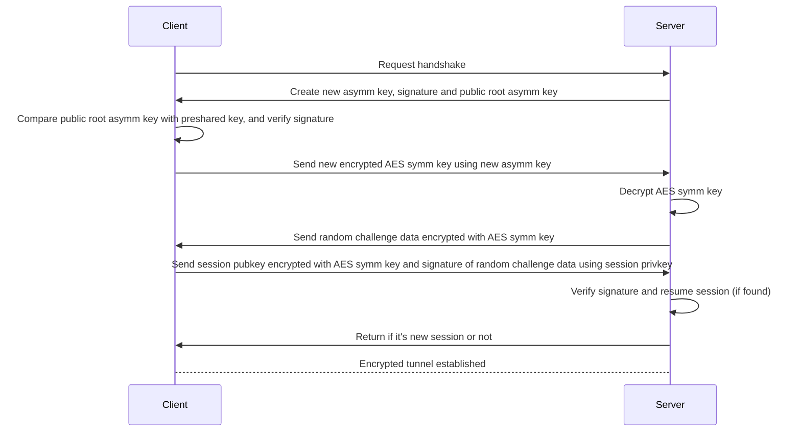

# js-protov2d

> ⚠️ This package is still in development, but should be usable. Use at your own risk, and please report any bugs you find.

ProtoV2d is a variant of [ProtoV2](https://github.com/BadAimWeeb/js-protov2) protocol, removing libp2p and instead only uses WebSocket to communicate. This results in not being able to seamlessly move the servers, but is much more lightweight and easier to use.

This package will expose a quantum-resistant encrypted tunnel, even when using unsecured WebSocket connections, and can be reconnectable even when using different client IP addresses.



Install:

```bash
npm install @badaimweeb/js-protov2d superdilithium
```

Preshared key generation:

```ts
import pkg from "superdilithium";
const { superDilithium } = pkg;
let keyPair = await superDilithium.keyPair();

let uint8tohex = (arr: Uint8Array) => Array.from(arr).map((x) => x.toString(16).padStart(2, "0")).join("");

let privateKey: string = uint8tohex(keyPair.privateKey);
let publicKey: string = uint8tohex(keyPair.publicKey);
let publicKeyHash: string = uint8tohex(new Uint8Array(await crypto.subtle.digest("SHA-256", keyPair.publicKey)));

// Note: you should only share public key hash since public key is well over 6kb
```

Server usage:
```ts
import { Server } from "@badaimweeb/js-protov2d";

let server = new Server({
    port: 0, // 0 = random TCP port
    privateKey,
    publicKey
});

let port: number = server.port;

server.on("connection", session => {
    session.on("data", (QoS, data) => {
        // QoS 0: send once
        // QoS 1: send until acknowledged

        // handle data here (data is Uint8Array)
    });

    // send data
    session.send(QoS, data);
});
```

Client usage:
```ts
import { connect } from "@badaimweeb/js-protov2d";

// If you have public key:
let client = await connect({
    url: `ws://localhost:${port}`,
    publicKey: {
        type: "key",
        key: publicKey
    }
});

// or public key hash:
let client = await connect({
    url: `ws://localhost:${port}`,
    publicKey: {
        type: "hash",
        hash: publicKeyHash
    }
});

// send data
client.send(QoS, data);

// receive data
client.on("data", (QoS, data) => {
    // handle data here (data is Uint8Array)
});
```
